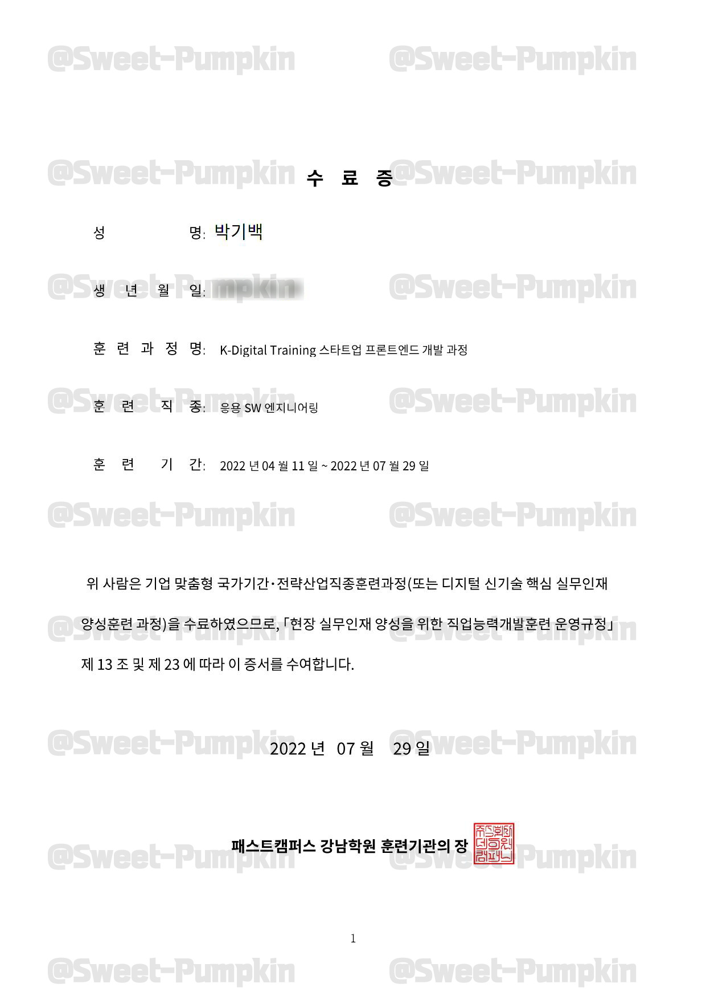

## 패스트캠퍼스 메가바이트스쿨
### 스타트업 프론트엔드 개발자 국비과정
> 훈련 기간 : 2022.04.11 ~ 2022.07.29 
> 훈련 내용 : HTML, CSS, JS, React, TS, Redux 등 개발 언어 습득 
> 주요 프로젝트 : 은행 앱(JS), 뉴스 검색 웹(React), 핀테크 웹(React) 

 

#### 수료증

 

#### 수료식
