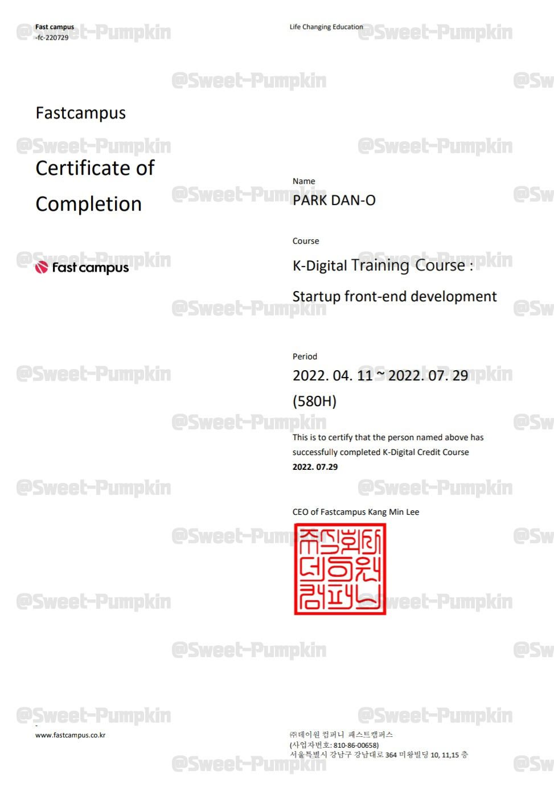
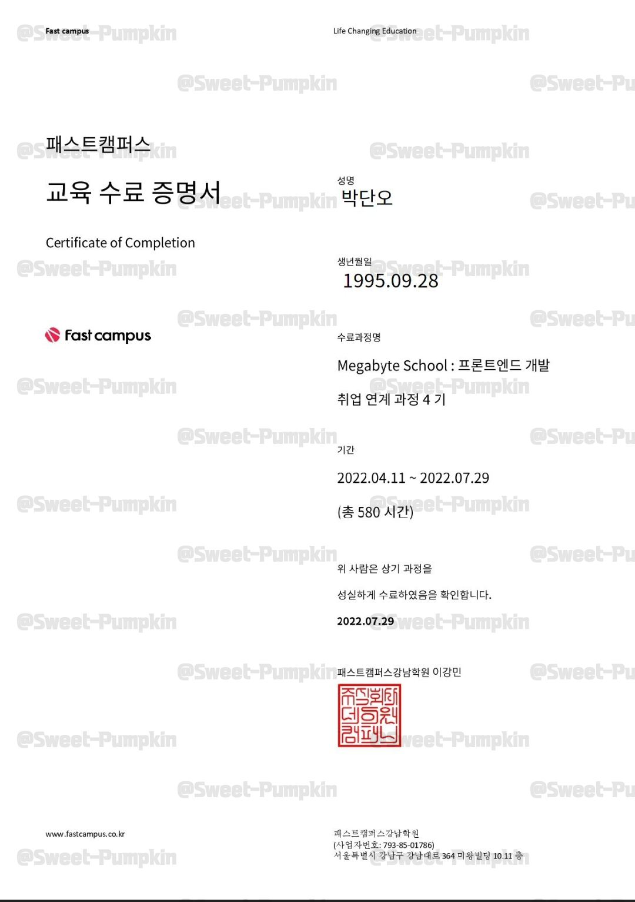
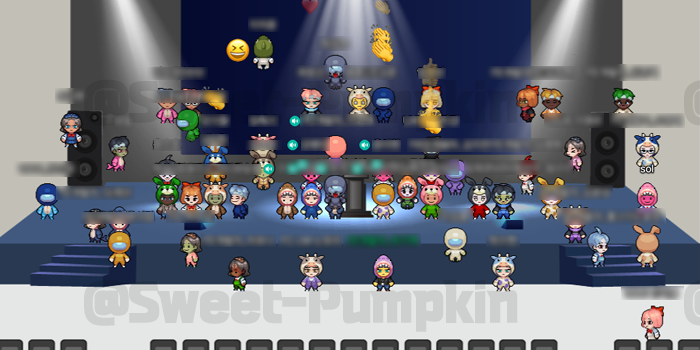

<h2>패스트캠퍼스 메가바이트스쿨</h2>

<h3>
  스타트업 프론트엔드 개발자 국비과정
  
</h3>

> 훈련 기간 : 2022.04.11 ~ 2022.07.29 
> 훈련 내용 : HTML, CSS, JS, React, TS, Redux 등 개발 언어 습득 

 

<h3>주요 프로젝트</h3>

<h4>
  - 파이널 프로젝트 : 부동산 핀테크 웹
  
  
<h4>

<h4>
  - React 미니 프로젝트 : 뉴스 검색 웹
  
<h4>

<h4>
  - JS 토이 프로젝트 : 은행 앱
  
<h4>

 

<h3>수료증</h3>

 

<h3>수료식</h3>
